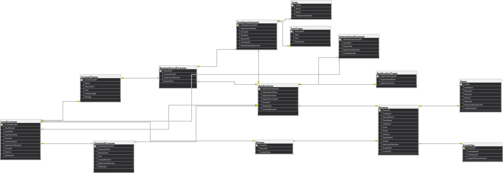

# Driving & Vehicle Licensing Department (DVLD) Management System

A comprehensive, desktop-based enterprise application built to automate and manage the core operations of the Driving & Vehicle Licensing Department (DVLD). Built with **C# (.NET)**, **Windows Forms**, and **SQL Server / Supabase**, following a strict **3-Tier Architecture** pattern.

## Table of Contents
- [Architecture Overview](#architecture-overview)
- [Key Features](#key-features)
- [Database & Relational Schema](#database--relational-schema)
- [Tech Stack & Tools](#tech-stack--tools)
- [Live Demo & Download](#live-demo--download)
- [Installation & Setup](#installation--setup)

## Architecture Overview

The system is designed using a **3-Tier Architecture** to separate concerns, ensure scalability, and improve maintainability:

1. **Presentation Layer (UI - WinForms):** Handled all UI screens, user input validations, event listeners, and data presentation.
2. **Business Logic Layer (BLL):** Contains all core business logic, application state management, test prerequisites, application fee structures, and security logic.
3. **Data Access Layer (DAL):** Responsible for directly communicating with the SQL Database through secure parameterized queries/stored procedures to prevent SQL Injection.

## Key Features

### Person Management
- Complete CRUD operations (Add, Edit, Delete, Show Info, List All).
- Multi-field search and filtering capabilities (National ID, Phone, Person ID, Full Name).
- **Image Handling:** Person images are securely uploaded and fetched via **Supabase Cloud Storage**.

### User Management & Security
- **User Creation:** Users are linked to existing `Person` records via search (Phone, National ID, Person ID).
- **Secure Authentication:** Password hashing stored in the database.
- **"Remember Me" Feature:** Auto-login support on subsequent system launches.
- **OTP-Based Forget Password System:**
  - Automated OTP dispatch via Email.
  - Rate limiting: Maximum **3 attempts**
  - Anti-abuse lock: **12-hour temporary block** if 3 attempts are exhausted.
  - Auto-reset: `lastAttemptAt` tracking resets counters back to default if more than 24 hours have passed.
  - OTP Expiry: Valid for **10 minutes** or invalidated after **3 incorrect entries**.
- **Account Settings:** Change password, view current user profile, and secure sign-out.

### License Applications & Testing Workflow
- **Local Driving License Requests:**
  - Class-based local license application creation with validation against duplicate active requests.
  - **3-Stage Testing Sequence:**
    1.  **Vision Test**
    2.  **Written Test**
    3.  **Street Test**
  - Mandatory appointment scheduling for each test stage (prevents booking if an active appointment exists or test passed).
  - **Retake Test Application:** Automatically unlocks if the applicant fails a test.
- **First-Time License Issuance:** Automatically generates driver records upon passing all 3 tests.
- **International Licenses:** Search by local license (requires active Class 3 Local License) and issue international license without duplicates.
- **License Renewal & Replacement:** Handles expired license renewals as well as Lost/Damaged replacements while archiving inactive licenses.
- **License Detain & Release:** Full workflow to detain licenses, release detained licenses, with tracking and filtering capabilities.

### External Communications
- **WhatsApp Integration:** Direct dispatching via WhatsApp Web auto-filling text and launching chat with the target phone number.
- **Email Notifications:** Automated email integration.

## Database & Relational Schema

*(Click on the image above to view it in full high resolution)*

## Tech Stack & Tools

- **Language:** C#
- **Framework:** .NET Framework (Windows Forms)
- **Database:** Microsoft SQL Server / Cloud DB
- **Cloud Storage:** Supabase Cloud Storage (Person Profile Images)
- **Architecture:** 3-Tier Architecture (Presentation, Business, Data Access)
- **Version Control:** Git & GitHub

## Live Demo & Download

You can download the App to test and run the application locally:

 **[Download DVLD Setup Application](https://mustafa548.github.io/Download_DVLD_App/)**
  - You Can Use These Information For Test:
  - **User Name:** User1
  - **Password:** 1234
